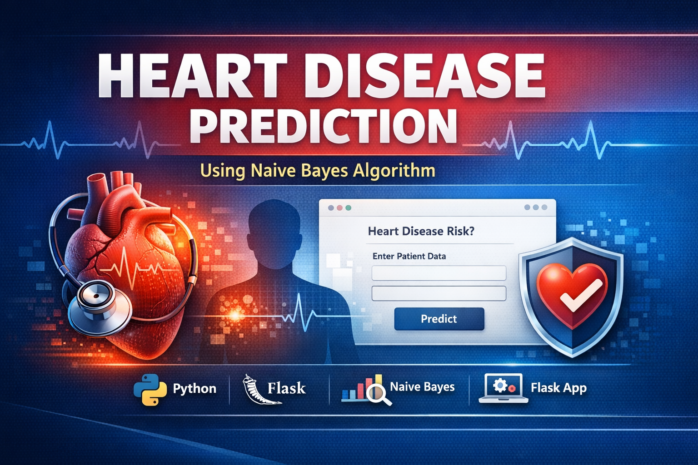

  

# ❤️ Heart Disease Prediction using Machine Learning

## 📌 Overview
This project predicts the likelihood of heart disease using Machine Learning.  
It uses the Naive Bayes algorithm and is deployed as a Flask web application.

The goal is to assist in early detection of heart disease based on medical attributes.

---

## 🚀 Features
- Predicts heart disease based on user input  
- Web-based interface using Flask  
- Fast and accurate predictions  
- User-friendly UI  
- Real-time result display  

---

## 🛠 Tech Stack
- Python  
- Machine Learning  
- Scikit-learn  
- Pandas  
- NumPy  
- Flask  
- HTML / CSS  

---

## 📊 Dataset
The dataset includes key medical attributes:
- Age, Sex  
- Chest Pain Type  
- Blood Pressure  
- Cholesterol  
- ECG Results  
- Heart Rate  
- Exercise Angina  
- ST Depression  
- Thalassemia  

---

## 🧠 Model Used
**Naive Bayes Classifier**

### Why Naive Bayes?
- Simple and efficient  
- Works well for classification problems  
- Fast training and prediction  

---

## 🌐 Web Application
- Users input medical details  
- Model predicts heart disease risk  
- Results displayed instantly  

---

## 🔗 Links
- 💼 LinkedIn: https://www.linkedin.com/in/senthamil45  
- 🌍 Portfolio: https://senthamill.vercel.app/  
- 💻 GitHub: https://github.com/selvan-01/Heart_Disease_Prediction
